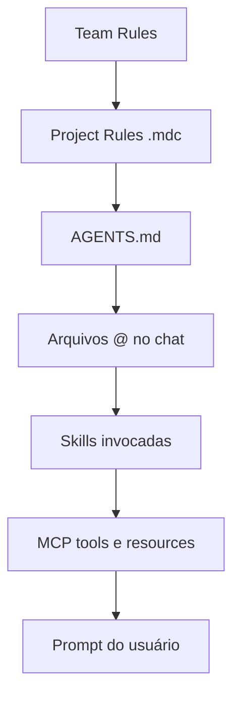

# Context engineering

*Context engineering* é o desenho deliberado do que o modelo vê em cada turno: rules, arquivos `@`, skills, MCP e instruções do usuário.

## Camadas de contexto (ordem típica)

### 1. Team Rules (opcional)

Regras da organização no dashboard Cursor. Têm precedência sobre Project e User Rules em conflito.

[Team Rules](https://cursor.com/docs/context/rules#team-rules)

### 2. Project Rules

`.cursor/rules/*.mdc` — versionadas com o Git.

### 3. AGENTS.md

Markdown simples na raiz ou subpastas.

### 4. Arquivos no chat

`@ProductCard.tsx`, `@docs/decisions/002-in-memory-state.md` — contexto pontual sem poluir rules.

### 5. Skills

Playbooks sob demanda (`/catalog-crud`). O Agent pode auto-selecionar pela `description`.

### 6. MCP

Ferramentas (browser, docs, APIs) quando o Agent as chama.

## Quando usar cada mecanismo

| Necessidade | Mecanismo |
|-------------|-----------|
| "Sempre sem API neste repo" | Rule `alwaysApply` |
| "Padrão só em componentes TSX" | Rule com `globs` |
| "Como fazer deploy do catálogo" (futuro) | Skill |
| "Abrir localhost e clicar em Filtrar" | Skill + MCP browser |
| Onboarding rápido humano/Agent | `AGENTS.md` |

## Boas práticas (documentação Cursor)

1. Rules **curtas e acionáveis** (< 500 linhas)
2. **Referenciar** arquivos com `@` em vez de copiar código
3. Não duplicar linter/formatter nas rules
4. Adicionar rules quando o Agent **erra repetidamente**, não antecipadamente demais
5. Skills para fluxos com **vários passos** verificáveis

[Rules best practices](https://cursor.com/docs/context/rules#best-practices)

## Exercícios neste repositório

### A — Observar globs

1. Abra `src/data/products.seed.ts`
2. Pergunte: *"Posso usar fetch para carregar produtos?"*
3. Esperado: citação de `mock-data` / ADR-003

### B — Contexto mínimo

1. `@src/types/product.ts` apenas
2. Peça um resumo do modelo de dados
3. Compare com pedir o mesmo sem `@`

### C — Skill + MCP

1. `/verify-catalog-ui`
2. Observe tools MCP no painel do chat

## Leitura adicional

- [Cursor Rules](https://cursor.com/docs/context/rules)
- [Cursor Skills](https://cursor.com/docs/context/skills)
- [Cursor MCP](https://cursor.com/docs/context/mcp)
